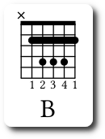
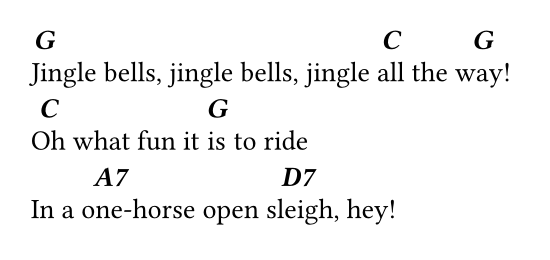

# typst-chords

A library to write song lyrics with chord diagrams in Typst. This library uses [typst-canvas](https://github.com/johannes-wolf/typst-canvas) to generate the diagrams.

## Functions

With `typst-chords` you can to use 2 functions `set-graph-chords` and `set-single-chords`. These functions returns other functions (a closure).

`set-graph-chords` function:

```typst
// Chord with diagram
// Return a function with these settings
#let guitar-chord = set-graph-chords(
  strings: number,
  font: string,
)
```

- `strings`: number of strings of the instrument (columns of the grid), default: 6, `Optional`
- `font`: text font name, default: "Linux Libertine", `Optional`

The returned function from `set-graph-chords` has the following parameters:

```
// Generates a chord diagram
#guitar-chord(
  frets: number,
  fret-number: number or none,
  capos: array(array) or array(dictionary),
  fingers: array,
  notes,
  chord-name
)
```

- `frets`: number of frets (rows of the grid), default: 5, `Optional`
- `fret-number`: shows the fret position, default: none, `Optional`
- `capos`: adds one o many capos on the graph, default: (), `Optional`

  ```
    // array(array) or array(dictionary)
    ((
      fret: number,
      start: number,  // the first string
      end: number     // the last string
    ),)
  ```

  - `fret`: number of the fret position relative to grid, `Required`
  - `start`: number of the first string, `Required`
  - `end`: number of the last string, `Required`

- `fingers`: shows the finger numbers, default: (), (0: without finger, number: one finger), `Optional`
- `notes`: shows the notes on the graph ("x": mute note, "n": without note, 0: air note, number: one note), `Required`
- `chord-name`: shows the chord name, `Required`

Example:

```
// Guitar B chord
#guitar-chord(
  capos: ((fret: 2, start: 1, end: 5),), // capos: ((2, 1, 5),)
  fingers: (0, 1, 2, 3, 4, 1),
  ("x", "n", 4, 4, 4, "n")
)[B]
```



`set-single-chords` function:

```typst
// Single chord (without diagram)
// Return a function with these settings
#let chord = set-single-chords(
  style: "italic",
  weight: "semibold",
  ...
)
```

The chord without diagram is used to write the chord over a word. All parameters of `set-single-chords` are the same of `text` of `typst`.

The returned function from `set-single-chords` has the following parameters:

```typst
#chord(
  body,
  chord-name
)
```

- `body`: is the word or words where the chord goes, `Required`
- `chord-name`: displays the chord name over the selected words in the body, `Required`

Example:

```typst
#chord[Jingle][G] bells, jingle bells, jingle #chord[all][C] the #chord[way!][G] \
#chord[Oh][C] what fun it #chord[is][G] to ride \
In a #chord[one-][A7]horse open #chord[sleigh,][D7] hey!
```



## Usage

`typst-chords` uses [typst-canvas](https://github.com/johannes-wolf/typst-canvas) to generate the chord diagrams.
We need to download `typst-canvas` and `typst-chords`.

Steps:

    $ mkdir my_lyrics && cd my_lyrics
    $ git clone https://github.com/johannes-wolf/typst-canvas
    $ git clone https://github.com/ljgago/typst-chords
    $ touch lyrics.typ

Open `lyric.typ` with your favorite editor and import the file `#import "typst-chords/chords.typ": *`

## Examples:

```typst
#let guitar-chord = set-graph-chords()

// Guitar Cm chord
#guitar-chord(
  fret-number: 3,
  capos: ((1, 1, 5),),
  fingers: (0, 1, 3, 4, 2, 1),
  ("x", "n", 3, 3, 2, "")
)[Cm]
```

```typst
#let ukulele-chord = set-graph-chords(strings: 4)

// Ukulele C chord
#ukulele-chord(
  fingers: (0, 0, 0, 3),
  (0, 0, 0, 3)
)[C]
```

## License

[MIT License](./LICENSE)
